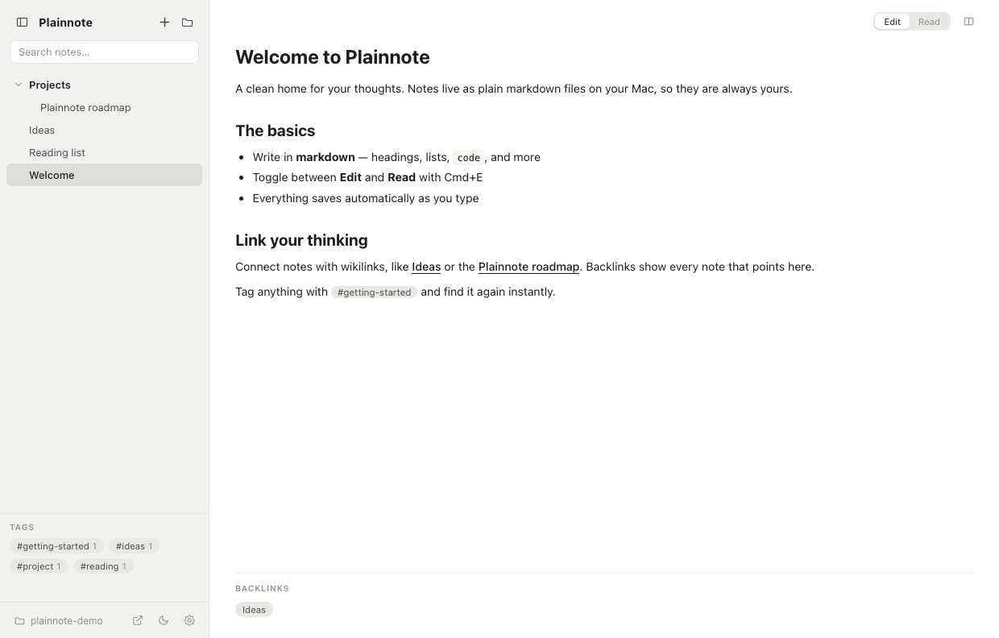

<p align="center">
  
</p>

<h1 align="center">Plainnote</h1>

<p align="center"><b>Plain markdown notes, no clutter.</b></p>

<p align="center">
A clean, local-first note-taking app for macOS. Your notes are plain <code>.md</code> files
in a folder you own - no database, no lock-in, no accounts.
</p>

<p align="center">
  
  
  
  
</p>

<p align="center">
  
</p>

## Features

- **Live editing** - the line you're on is raw markdown, everything else stays rendered; Cmd+E toggles Edit/Read
- **Wikilinks** - type `[[` and autocomplete a link to any note; backlinks show every note that points back
- **Tags** - `#tag` anywhere becomes a clickable pill, browsable from the sidebar
- **Split view** - two notes side by side, each pane with its own back/forward history (Cmd+[ / Cmd+])
- **Search** - across the whole vault (Cmd+Shift+F) or within a note, with highlights (Cmd+F)
- **Organize** - folders, drag and drop, pinned notes, trash-safe delete
- **Export** - any note to PDF or a standalone HTML page
- **Your files** - plain `.md` in `~/Documents/Plainnote`; edit them with any other tool and the app picks up the changes live
- **The details** - dark mode, optional line numbers, note-level undo, import by drop, stats

## Install & develop

```bash
npm install          # first time; if Electron's binary is missing: node node_modules/electron/install.js
npm start            # run from source
npm run package      # build Plainnote.app and install it to ~/Applications
```

## Architecture

| File | Role |
|------|------|
| `main.js` | Electron main process - file I/O, vault watcher, dialogs, PDF export |
| `preload.js` | Context-isolated bridge exposing a minimal `window.api` |
| `renderer.js` | The entire UI - panes, live editor, sidebar, search, menus |
| `styles.css` | Hand-written CSS, themed via custom properties |
| `assets/` | App icon sources and rendered PNGs |
| `scripts/` | Dev-only utilities (icon rendering, screenshots, layout tests) |

Notes are read into memory on launch and re-read when the vault changes on disk.
Backlinks, tags, and search are computed in memory - no index files, no database.

## License

AGPL-3.0
