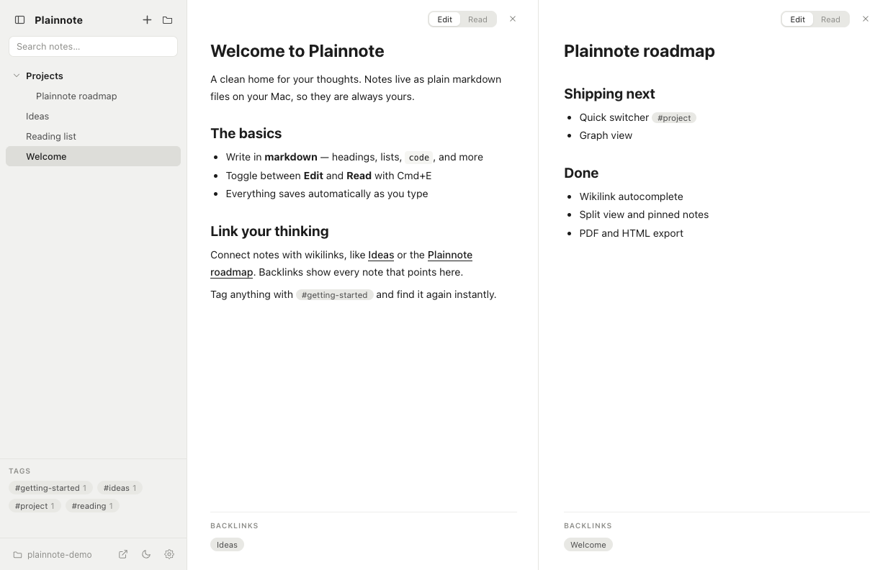
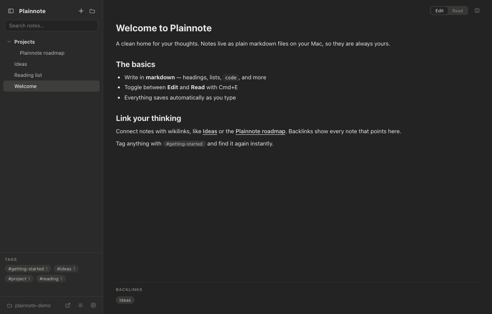

<p align="center">
  
</p>

<h1 align="center">Plainnote</h1>

<p align="center"><b>Plain markdown notes, no clutter.</b></p>

<p align="center">
A clean, local-first note-taking app for macOS. Your notes are plain <code>.md</code> files
in a folder you own — no database, no lock-in, no accounts.
</p>

<p align="center">
  
  
  
  
</p>

<p align="center">
  
</p>

## Features

- **Live editing** — the line you're on shows raw markdown, everything else stays rendered. Press Enter and it formats. (Cmd+E toggles Edit/Read)
- **Wikilinks** — type `[[` and autocomplete a link to any note; a backlinks panel shows every note that points back
- **Tags** — `#tag` anywhere becomes a clickable pill; browse them in the sidebar
- **Split view** — two notes side by side with a draggable divider; drop a note onto the page to open the split

<p align="center">
  
</p>

- **Search** — vault-wide search (Cmd+Shift+F) and in-note find with highlights (Cmd+F)
- **Organize** — folders, drag-and-drop, pinned notes, right-click rename, trash-safe delete
- **Export** — any note to PDF or a standalone HTML page
- **Own your files** — notes live in `~/Documents/Plainnote`; edit them with any other tool and the app picks up the changes live
- **The details** — dark mode, optional line numbers, per-note history (Cmd+[ / ]), note-level undo, import `.md`/`.txt` by drop, stats

<p align="center">
  
</p>

## Install & develop

```bash
npm install          # first time; if Electron's binary is missing: node node_modules/electron/install.js
npm start            # run from source
npm run package      # build Plainnote.app and install it to ~/Applications
```

## Architecture

| File | Role |
|------|------|
| `main.js` | Electron main process — file I/O, vault watcher, dialogs, PDF export |
| `preload.js` | Context-isolated bridge exposing a minimal `window.api` |
| `renderer.js` | The entire UI — panes, live editor, sidebar, search, menus |
| `styles.css` | Hand-written CSS, themed via custom properties |
| `assets/` | App icon sources and rendered PNGs |
| `scripts/` | Dev-only utilities (icon rendering, screenshots, layout tests) |

Notes are read into memory on launch and re-read when the vault changes on disk.
Backlinks, tags, and search are computed in memory — no index files, no database.

## License

MIT
